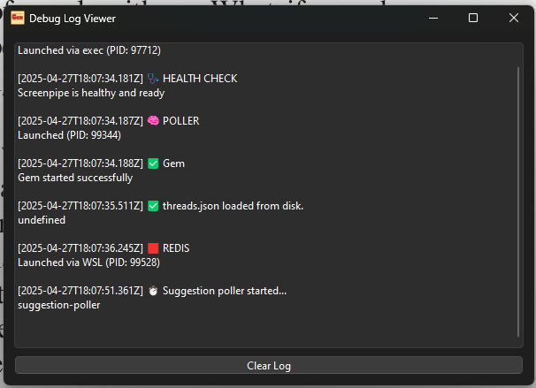
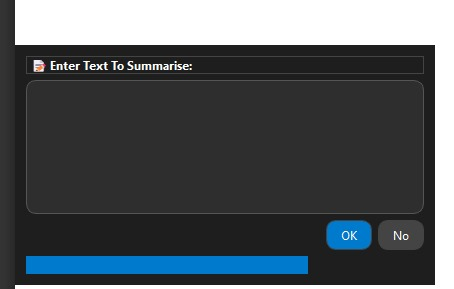

# 🚀 Project Title

> Gem - Your Real Time AI Assistant

---

## 📌 Problem Statement

**Problem Statement 5 – Build the future of AI Computer Control with Screenpipe's Terminator**

---

## 🎯 Objective
Traditional AI assistants often feel unresponsive and rigid, behaving more like preprogrammed robots that passively wait for user commands.
This stiffness makes interactions feel unnatural and disconnected.

Additionally, most traditional agents operate without real awareness of what the user is doing, acting only when explicitly told to.
They function like isolated machines, reactive rather than proactive.

While this design still works today, it leaves much room for improvement.
By introducing real-time assistance that actively understands and adapts to the user’s context, we can create a far more fluid, helpful, and human-like experience.

Gem is a next-generation AI agent designed to assist users seamlessly in their everyday tasks.
Unlike traditional AI assistants that passively wait for instructions, Gem actively observes the user's screen, intelligently searching for opportunities to help.
When it detects something it can assist with, Gem proactively prompts the user — offering support exactly when it's needed.

---

## 🧠 Team & Approach

### Team Name:  
Byte Warriors

### Team Members:  
- Anshu Sharma (AnshuSharma111 / https://www.linkedin.com/in/anshu-sharma-618917287/ / Leader)  
- Hardik Kumar (hardikgoesgit/ https://www.linkedin.com/in/hardik-kumar-rrh/ /member)

### Your Approach:  
- We chose this problem because it seemed like the one most fun to tackle and the one we would have the most fun building
- One of the biggest challenges we faced was trying to get the Screenpipe SDK to work. Apart from that, creating the installer and making sure it worked propely also took it's fair share of time
- A key point of building Gem was designing it's architecture. Trying to keep it responsive and fast while also processing huge amounts of data through LLMs. The 5 layer architecture is something we are most proud of

---

## 🛠️ Tech Stack

### Core Technologies Used:
- Frontend: C++, Qt6
- Backend: Javascript, NodeJS, Redis
- APIs: Groq SDK, Screenpipe SDK
- Hosting: None, installer for windows

### Sponsor Technologies Used (if any):
- [✅] **Groq:** We used Groq for fast, low latency processing of data from screenpipe. From cleaning that data to suggesting actions by performing sentiment analysis on it, Groq provided a fast and reliable API with various available LLMs to use. 
- [✅] **Screenpipe:** We used Screenpipe to peerform OCR and get data of what is happening on the user's screen so that the LLM can suggest some actions
---

## ✨ Key Features

The key features of Gem are as follows:

- ✅ Real-time Agent: Gem works when you work. Just switch her ON and she will observe what is going on in the screen and chip in to help 
- ✅ Fast and Alive agent: Due to Groq, the processing of data through 5 layers is fast and therefore, Gem acts fast. She feels responsive and smooth 
- ✅ Privacy Controls: You can select what apps you do not want Gem to monitor and she won't monitor those apps. This ensures user privacy
- ✅ Logs: The user can press Ctrl + Shift + D on their keyboards when Gem is open and this will open the Debug Log Viewer where the user can safely monitor all activity Gem is doing

---

## 📽️ Demo & Deliverables

- **Demo Video Link:** https://youtu.be/5jpG8ykBkFY
- **Pitch Deck / PPT Link:** https://drive.google.com/file/d/1qPjkg2eDsrbL4hA5GOTKZQpat8zFOzTx/view?usp=sharing

---

## ✅ Tasks & Bonus Checklist

- [✅] **All members of the team completed the mandatory task - Followed at least 2 of our social channels and filled the form** (Details in Participant Manual)  
- [✅] **All members of the team completed Bonus Task 1 - Sharing of Badges and filled the form (2 points)**  (Details in Participant Manual)
- [✅] **All members of the team completed Bonus Task 2 - Signing up for Sprint.dev and filled the form (3 points)**  (Details in Participant Manual)

---

## 🧪 How to Run the Project

[FOR WINDOWS ONLY]
1) Go to screenpipe's repository and install screenpipe on your machine: https://github.com/mediar-ai/screenpipe/tree/main using the command given there
2) Download the installer from this link: https://drive.google.com/file/d/1tp6eun473hlaHl6h7f8ktVwSbGr6LLUR/view?usp=sharing
3) [Optional] Have wsl installed on your system and have redis installed in it

---

## 🧬 Future Scope

List improvements, extensions, or follow-up features:

- 📈 More Tools: Due to the structure of Gem, the boiler plate code has been set up and the only thing remaining are the expansions. We can add as many tools we want to add on top of it. For example, Book a meeting on calendar, Make Notes for the user and so on.
- 🛡️ Enhanced privacy controls: We can give the user more freedom over what is monitored on their screen. Even give them the option to switch to offline LLMs via Ollama
- 🌐 Localization / broader accessibility : 

---

## 📎 Resources / Credits

- Groq SDK: https://console.groq.com/home
- Screenpipe SDK: https://docs.screenpi.pe/terminator/js-sdk-reference

---

## 🏁 Final Words

It was a lot of fun building this application. We are grateful to the organisers for holding such a well organised event at such a large scale. We are also grateful to our fellow participants for making this event such a resounding success. May the best hacker win! Cheers!

---
